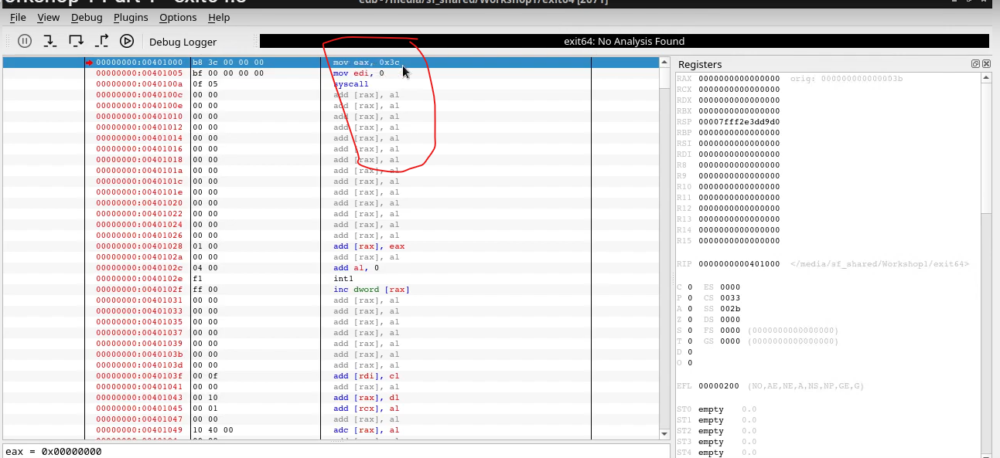
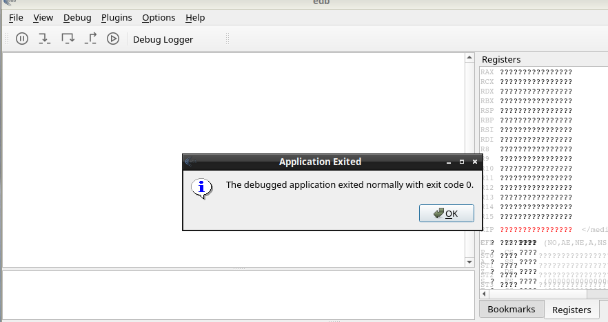
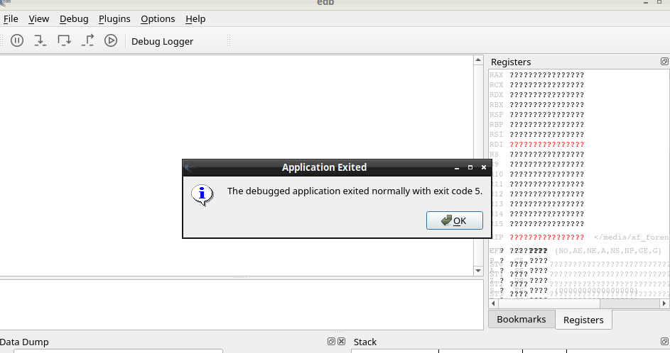

# UCMCO5607 - Ethical Hacking

Videos:

Install Virtual Box

* <https://www.youtube.com/watch?v=c0gPkwlw25A>

Import Fedora VM

* <https://www.youtube.com/watch?v=evFTF_nnLAY>

Workshop 1 Part 1 - exit64.s

* <https://www.youtube.com/watch?v=NKYU8V3I-a0>

Workshop 1 Part 2 - write64.s

* <https://www.youtube.com/watch?v=xV6iHhQy3yQ>

Workshop2 - Loop and Function calling - part1

* <https://www.youtube.com/watch?v=mS5W456mQCQ>

Workshop2 - Loop and Function calling - part2

* <https://www.youtube.com/watch?v=Qrnc7GcIxto>

Workshop 3

* <https://www.youtube.com/watch?v=2nKgZxIPDWc>


Shared folder location
<C:\work\forensics>

## Workshop 1 - Part 1 exit64.s


```assembly
section .text

global _start
_start:
  mov rax, 60       ; the exit() call number
  mov rdi, 5        ;   // something to look at
  syscall           ; make the call
```

### Description of first Assembly program

```assembly
section .text   ;Code lives in text section of the assembler file

section .data   ;Data would live in the data section of the file

global _start   ;This is the label that defines where the program starts

_start:         ;This is where the program goes to to start

mov rax, 60     ;This is the first instruction in the program. It moves the value 60 into the rax register

mov rdi, 5      ;Moves the value 5 to the rdi register

syscall         ;This is the system call that will call the exit() function
```

USE THIS WEBSITE: https://blog.rchapman.org/posts/Linux_System_Call_Table_for_x86_64/

Go to the rax column and find 60 - which shows "sys_exit"
sys_exit arguments are in the columns on the right
sys_exit takes one

Note: you pass in the arguments through  registers
For 60 you have to pass in the argument %rdi which is the error code we want to return back to whatever  back to whatever called this
So 5 is what we are going to return to the operating system 

The syscall will look at the two registers 
It will see that rax has 60 

### Running the program

Use `nasm` the assembly compiler to compile the program.

```bash
[cyber@cyberbox ~]$ nasm -f elf64 -o exit64.o exit64.s
```

Use `ld` the linker to link the object file to an executable.

```bash
[cyber@cyberbox ~]$ ld -o exit64 exit64.o
```

Run the program.

```bash
[cyber@cyberbox ~]$ ./exit64
```

Check the exit code.

```bash
[cyber@cyberbox ~]$ echo $?
5
```

Therefore last run program was exited with the exit  code 5.

If we run another command:
    
```bash
[cyber@cyberbox ~]$ echo hello
```
    
Then check the exit code.

```bash
[cyber@cyberbox ~]$ echo $?
0
```

So the last run program has an exit code of 0 which means it ran successfully.

NOTE: You can go bak into the original assembly code and shnge teh return code from 5 to 0 and recompile and relink and rerun the program and you will see that the exit code will be 0.

### Comments in assembly

Comments in assembly are denoted by a semi-colon `;`

```assembly
; This is a comment
```

REturn codes are important because teh OS may need to know if our program has run successfully or not - however other calling programs may also need to know if our program has run successfully or not.

### Using EDB

You can use EDB to debug the program.

cd to the directory where the program is located and run the following command:

```bash
cd /home/cyber/soft/edb-build/
./edb
```

Then open the program and open our first assembler program that we have just written.

File > Open

file location:

```bash
/media/sf_forensics/workshop1/exit64
```

Note that exit64 is actuallly the executable file that we created.

* Minimise the edb output screen 
* change the font size Options> references > Appearance > DEfault register view font > 8

EDB disassembles the program and shows the assembly code.



``` assembly
mov eax, 0x3c  ;is the same as: mov rax, 60
```

because EDB reassembles the code and it can look a bit different.
Its effectively the same becasue `eax` and `rax` are the same register but `eax` is the lower 32 bits of `rax` (rax is the full 64 bits). We dont need all eight bytes to store the number 60 so we can use the lower 32 bits. eax is the lower 4 bytes of rax.

Also 60 represented in hex is 3c - the 0x is just a prefix to show that the number is in hex.

``` assembly

mov edi, 0  ;is the same as mov rdi, 0
```

Also edi is the 32 bit version of rdi. So when we see `mov edi, 5` in the assembly code it is the same as `mov rdi, 5` in the original code.

syscall is the same as the original code.

Note in assembler `mov` esseentially means copy. So `mov eax, 0x3c` means copy the value 0x3c into the eax register.

### Stepping into the assembler code when it executes

In the ribbon at the top use the step into button to step through the code.

First line of code is `mov eax, 0x3c` so we are copying the value 0x3c into the eax register.


Second line of code is `mov edi, 0` so we are copying the value 0 into the edi register.


Third line of code is `syscall` so we are making the system call i.e. goes into the kernel (gps: and the kernel will look at the registers and see that eax has 60 and edi has 0 and it will do the exit system call.)

If you do a final step into then the program will exit - with the following message:



### Binary code

EDB first shows the binary code that it is executing in the top left panel. Then in the top middle pannel it shows the disaemmbled equivalent code of the binary code. Then in the top right panel it shows the registers and their values.

The binary code in EDB is represented in hexidecimal notation.
b8 in hex means mov in assembly language and 3c is the hexidecimal representation of 60.

### Stepping through code with the debugger and changing the return code

If you want to change the exit code from 0 to 5 then you can do this by changing the value in the edi register from 0 to 5 - in the top middle panel of EDB right click on the relevant line of assembly code  > edit > binary edit > change the Hex value from 0 to 5.

Then step through the code unti the end i.e. after the syscall and you will see that the exit code is 5.




## Workshop 1 - Part 2 write64.s


